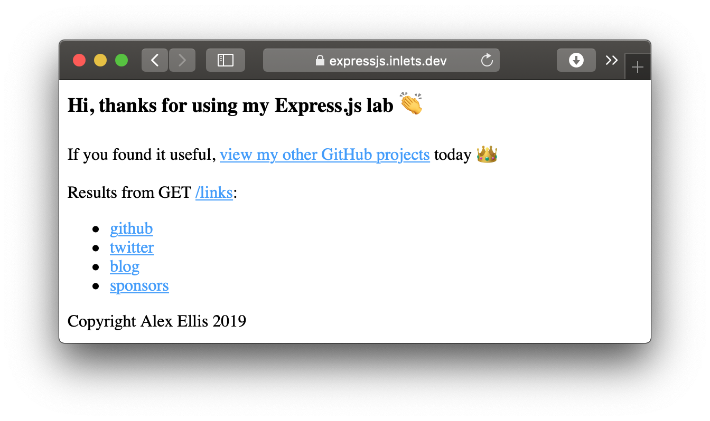

# Expose Your IngressController and get TLS from LetsEncrypt

In this quick-start we will configure the inlets-operator to use inlets-pro (a TCP proxy) to expose NginxIngress so that it can receive HTTPS certificates via LetsEncrypt and cert-manager.

## Pre-reqs

* A computer or laptop running MacOS or Linux, or Git Bash or WSL on Windows
* Docker for Mac / Docker Daemon - installed in the normal way, you probably have this already
* [KinD](https://github.com/kubernetes-sigs/kind) - the "darling" of the Kubernetes community is Kubernetes IN Docker, a small one-shot cluster that can run inside a Docker container
* [k3sup](https://github.com/alexellis/k3sup) - k3sup is an app installer that takes a helm chart and bundles it behind a simple CLI

## Create the Kubernetes cluster with KinD

We're going to use [KinD](https://github.com/kubernetes-sigs/kind), which runs inside a container with Docker for Mac or the Docker daemon. MacOS cannot actually run containers or Kubernetes itself, so projects like Docker for Mac create a small Linux VM and hide it away.

You can use an alternative to KinD if you have a preferred tool.

Get a KinD binary release:

```bash
curl -Lo ./kind "https://github.com/kubernetes-sigs/kind/releases/download/v0.7.0/kind-$(uname)-amd64"
chmod +x ./kind
sudo mv /kind /usr/local/bin
```

Now create a cluster:

```bash
 kind create cluster
Creating cluster "kind" ...
 ✓ Ensuring node image (kindest/node:v1.17.0) 🖼
 ✓ Preparing nodes 📦  
 ✓ Writing configuration 📜 
 ✓ Starting control-plane 🕹️ 
 ✓ Installing CNI 🔌 
 ✓ Installing StorageClass 💾 
Set kubectl context to "kind-kind"
You can now use your cluster with:

kubectl cluster-info --context kind-kind

Have a nice day! 👋
```

We can check that our single node is ready now:

```bash
kubectl get node -o wide

NAME                 STATUS     ROLES    AGE   VERSION   INTERNAL-IP   EXTERNAL-IP   OS-IMAGE       KERNEL-VERSION     CONTAINER-RUNTIME
kind-control-plane      Ready   master   35s   v1.17.0   172.17.0.2    <none>        Ubuntu 19.10   5.3.0-26-generic   containerd://1.3.2
```

The above shows one node Ready, so we are ready to move on.

## Install k3sup

You can use k3sup or helm to install the various applications we are going to add to the cluster below. k3sup provides an apps ecosystem that makes things much quicker.

```bash
# Get k3sup
curl -sSLf https://get.k3sup.dev/ | sudo sh
```

## Install the inlets-operator

Save an access token for your cloud provider as `$HOME/access-token`, in this example we're using DigitalOcean.

Make sure you set `LICENSE` with the value of your license.

```bash
export LICENSE="INLETS_PRO_LICENSE_JWT"
export ACCESS_TOKEN=$HOME/access-token

k3sup app install inlets-operator \
 --helm3 \
 --provider digitalocean \
 --region lon1 \
 --token-file $ACCESS_TOKEN \
 --license $LICENSE
```

> You can run `k3sup app install inlets-operator --help` to see a list of other cloud providers.

Set the `--region` flag as required, it's best to have low latency between your current location and where the exit-servers will be provisioned.

## Install nginx-ingress

```bash
k3sup app install nginx-ingress
```

## Install cert-manager

Install [cert-manager](https://cert-manager.io/docs/), which can obtain TLS certificates through NginxIngress.

```bash
k3sup app install cert-manager
```

## A quick review

Here's what we have so far:

* nginx-ingress
    An IngressController, Traefik or Caddy are also valid options. It comes with a Service of type LoadBalancer that will get a public address via the tunnel

* inlets-operator configured to use inlets-pro
    Provides us with a public VirtualIP for the IngressController service.

* cert-manager
    Provides TLS certificates through the HTTP01 or DNS01 challenges from LetsEncrypt

## Deploy an application and get a TLS certificate

This is the final step that shows everything working end to end.

TLS certificates require a domain name and DNS A or CNAME entry, so let's set that up

Find the External-IP:

```
kubectl get svc
```

Now create a DNS A record in your admin panel, so for example: `expressjs.example.com`.

Now when you install a Kubernetes application with an Ingress definition, NginxIngress and cert-manager will work together to provide a TLS certificate.

Create a staging issuer for cert-manager `issuer.yaml`:

```yaml
apiVersion: cert-manager.io/v1alpha2
kind: Issuer
metadata:
  name: letsencrypt-staging
spec:
  acme:
    server: https://acme-staging-v02.api.letsencrypt.org/directory
    email: you@example.com
    privateKeySecretRef:
      name: letsencrypt-staging
    solvers:
    - http01:
        ingress:
          class:  nginx
```

Edit `email`, then run: `kubectl apply -f issuer.yaml`.

Let's use helm3 to install Alex's example Node.js API [available on GitHub](https://github.com/alexellis/expressjs-k8s)

Create `custom.yaml`:

```yaml
ingress:
  enabled: true
  annotations:
    kubernetes.io/ingress.class: nginx
    cert-manager.io/issuer: "letsencrypt-staging"
  hosts:
    - host: expressjs.inlets.dev
      paths: ["/"]
  tls:
   - secretName: expressjs-tls
     hosts:
       - expressjs.inlets.dev
```

Now install
```bash
export PATH=$PATH:$HOME/.k3sup/bin/helm3/
helm repo add expressjs-k8s https://alexellis.github.io/expressjs-k8s/

# Then they run an update
helm repo update

# And finally they install
helm upgrade --install express expressjs-k8s/expressjs-k8s \
  --values custom.yaml
```

## Test it out

Now check the certificate has been created and visit the webpage in a browser:

```
kubectl get certificate

NAME            READY   SECRET          AGE
expressjs-tls   True    expressjs-tls   49s
```

Open the webpage i.e. https://api.example.com

Here's my example on my own domain:



You can view the certificate the certificate that's being served directly from your local cluster and see that it's valid:


## Wrapping up

Through the use of inlets-pro we have an encrypted control-plane for the websocket tunnel, and encryption for the traffic going to our Express.js app using a TLS certificate from LetsEncrypt.

You can now get a green lock and a valid TLS certificate for your local cluster, which also means that this will work with bare-metal Kubernetes, on-premises and with your Raspberry Pi cluster.

> Note if you're just looking for something to use in development, without TLS or encryption, you can install the inlets-operator without the `--license` flag and port 80 will be exposed for you instead. You can still use NginxIngress, but you won't get a certificate and it won't be encrypted e2e.
